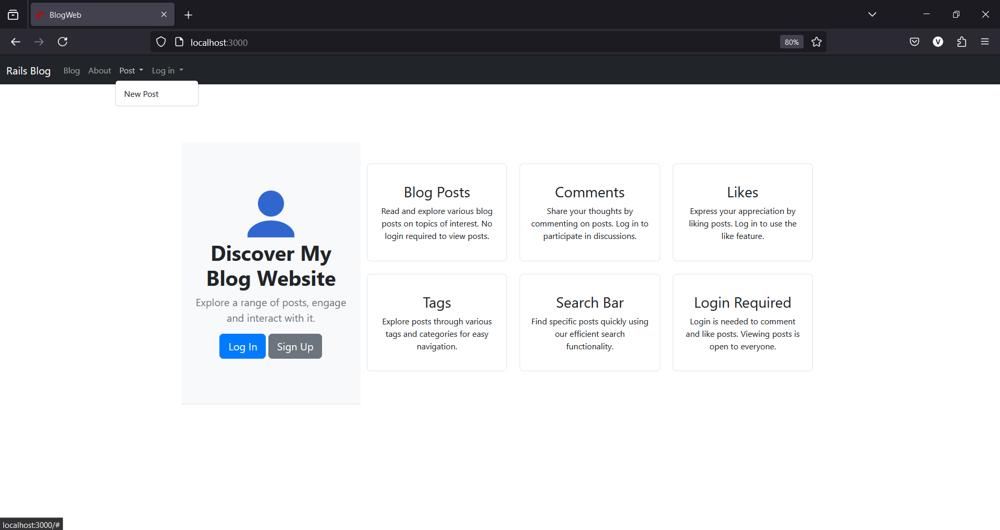
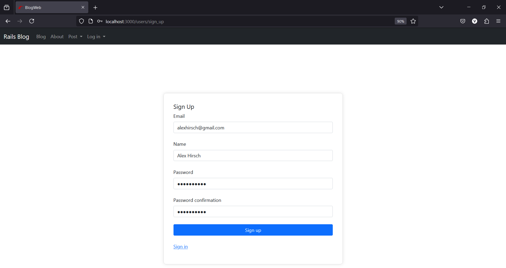
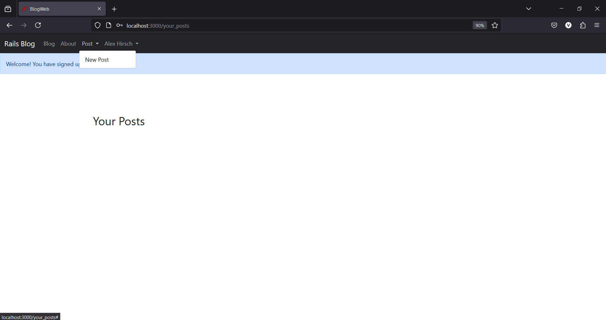
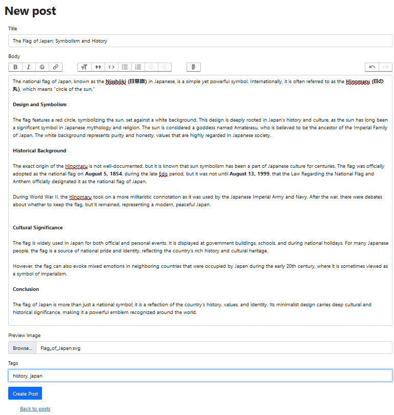
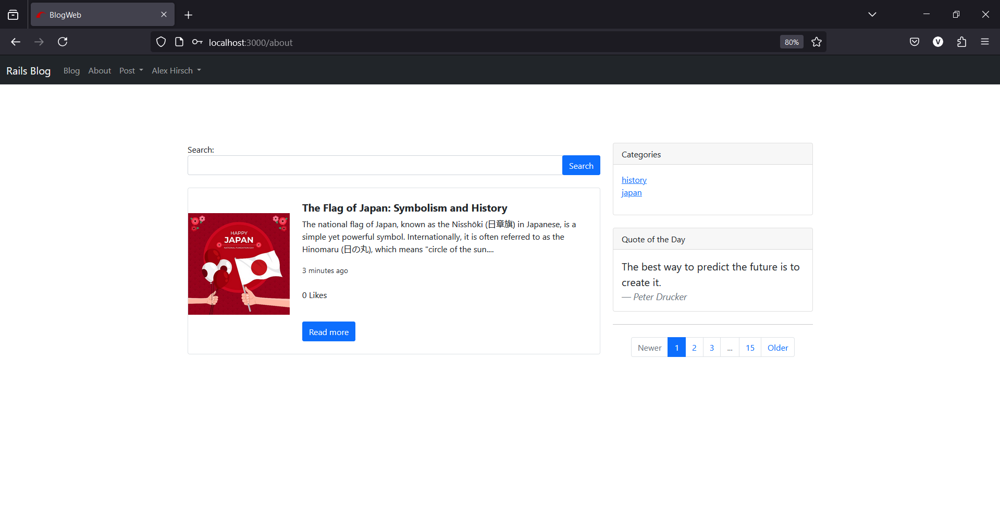
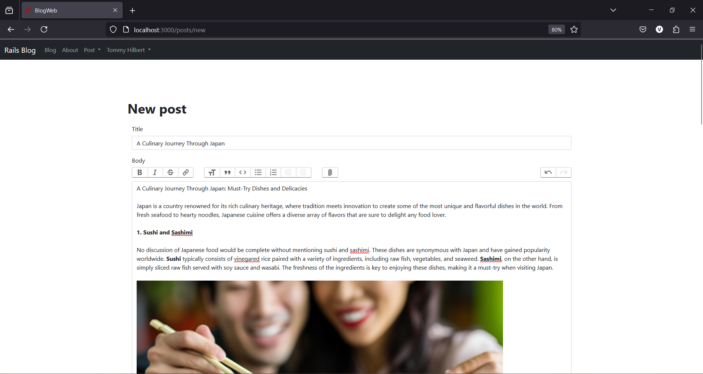
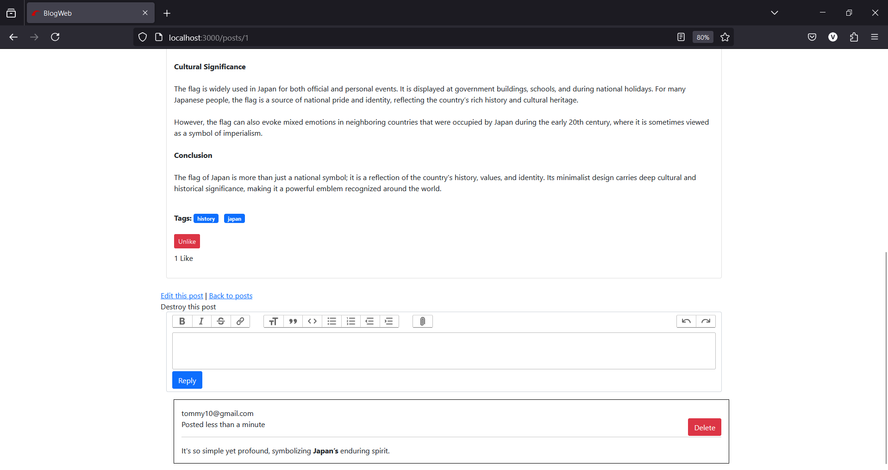

# Blog Website Overview

## Introduction

This blog website is a user-friendly platform that allows individuals to create, explore, and interact with blog posts. With features like comments, likes, tags, and a search bar, users can engage with content and connect with others. Below is a walkthrough of the website's key functionalities and user journey.

---

## Features

- **Comments**: Engage with blog posts by leaving comments.
- **Likes**: Show appreciation for posts by liking them.
- **Tags**: Organize and find posts using specific tags.
- **Search Bar**: Quickly search for content using keywords.
- **Login Required**: Users must log in to create new posts, like posts, or leave comments.

---

## Navigation

- **Home**: The homepage provides an overview of what the website offers, including commenting, liking, tagging, and searching.
- **About**: Displays posts from other users.
- **Blog**: Shows posts created by the logged-in user.
- **Posts**: Dropdown menu for creating a new blog post.
- **Login or Signup**: Buttons for account creation or access.

---

## User Walkthrough

### Homepage Overview
   - The main screen displays the homepage, which details the various features of the website: comments, likes, tags, a search bar, and the requirement to log in for certain actions. The navbar includes links to "About" (which shows other users' posts), "Blog" (which shows your posts), a dropdown "Posts" for creating new blogs, and a "Login or Signup" button. Posts can be viewed and searched without logging in, but creating a new blog, liking, and commenting require a user account.

### User Signup
   - As a new user, you'll begin by signing up. For this example, the user signs up as "Alex." During the signup process, you’ll be asked to enter details such as your email, name, and password.

### Redirect to Your Posts 
   - After signing up, you will be redirected to the "Your Posts" page. Initially, this page will be empty, so the next step is to create your first blog post.

### Creating a Blog Post
   - The first post will be about the Japanese flag. Enter the title, body, preview image, and tags for the post. The body of the post can be customized with hypertext links or additional images.

### Viewing the Post 
   - Once the post is published, it will appear on the "About" page, where other users' posts are also displayed. Around the posts, you’ll find various actions such as the search bar, tags, and a "Quote of the Day" feature, which refreshes daily.

### Creating a Second Post 
   - Since there’s only one post, let's create a second post, this time will be about Japanese culinary, by a user named "Tommy."

### Viewing Multiple Posts 
   - After the second post is published, the "About" page will now display two posts from two different users. On the "About" page, users can perform actions such as searching for posts using the search bar, which filters posts based on keywords. Tags can also be used to find posts with specific topics.

### Viewing Full Posts
   - Users can click the "Read More" button to view the full content of a post. Within the post view, you’ll see additional details like the post’s view count, and you can like or comment on the post.

### Author Information and User Profiles
   - The author’s name is highlighted with a hypertext link. Clicking on it will display the author’s name, email, and other information such as the comment count and view count for their posts. You can also view your own profile by hovering over your username in the navbar and clicking on “Profile.”

---

## Conclusion

This blog website provides an intuitive and interactive platform for users to create, share, and engage with content. With a clean and simple design, it’s easy to navigate, making it accessible for both new and experienced users. Whether you’re looking to share your thoughts or explore the ideas of others, this platform offers the tools and features needed for a rich blogging experience.
