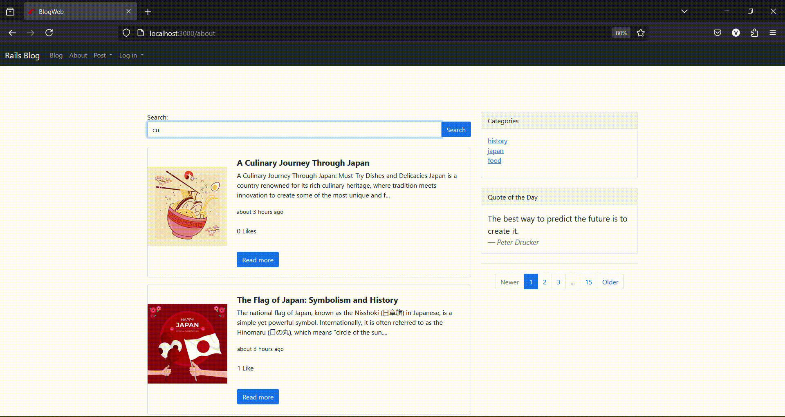

# Updates 
## August 2024 - Japanese Language Support Added! 🇯🇵

Key Changes:
All user-facing text has been translated into Japanese.

# アップデート
## 2024年8月 - 日本語サポートが追加されました！🇯🇵

主な変更点:
ユーザー向けのテキストはすべて日本語に翻訳されました。

# Blog Website Overview

## Introduction

This blog website is a user-friendly platform that allows individuals to create, explore, and interact with blog posts. With features like comments, likes, tags, and a search bar, users can engage with content and connect with others. Below is a walkthrough of the website's key functionalities and user journey.

---

## Features

- **Comments**: Engage with blog posts by leaving comments.
- **Likes**: Show appreciation for posts by liking them.
- **Tags**: Organize and find posts using specific tags.
- **Search Bar**: Quickly search for content using keywords.
- **Login Required**: Users must log in to create new posts, like posts, or leave comments.

---

## Navigation

- **Home**: The homepage provides an overview of what the website offers, including commenting, liking, tagging, and searching.
- **About**: Displays posts from other users.
- **Blog**: Shows posts created by the logged-in user.
- **Posts**: Dropdown menu for creating a new blog post.
- **Login or Signup**: Buttons for account creation or access.

---

## User Walkthrough

### Homepage Overview
   - The main screen displays the homepage, which details the various features of the website: comments, likes, tags, a search bar, and the requirement to log in for certain actions. The navbar includes links to "About" (which shows other users' posts), "Blog" (which shows your posts), a dropdown "Posts" for creating new blogs, and a "Login or Signup" button. Posts can be viewed and searched without logging in, but creating a new blog, liking, and commenting require a user account.

### User Signup
   - As a new user, you'll begin by signing up. For this example, the user signs up as "Alex." During the signup process, you’ll be asked to enter details such as your email, name, and password.

### Redirect to Your Posts 
   - After signing up, you will be redirected to the "Your Posts" page. Initially, this page will be empty, so the next step is to create your first blog post.

### Creating a Blog Post
   - The first post will be about the Japanese flag. Enter the title, body, preview image, and tags for the post. The body of the post can be customized with hypertext links or additional images.

### Viewing the Post 
   - Once the post is published, it will appear on the "About" page, where other users' posts are also displayed. Around the posts, you’ll find various actions such as the search bar, tags, and a "Quote of the Day" feature, which refreshes daily.

### Creating a Second Post 
   - Since there’s only one post, let's create a second post, this time will be about Japanese culinary, by a user named "Tommy."

### Viewing Multiple Posts 
   - After the second post is published, the "About" page will now display two posts from two different users. On the "About" page, users can perform actions such as searching for posts using the search bar, which filters posts based on keywords. Tags can also be used to find posts with specific topics.

### Viewing Full Posts
   - Users can click the "Read More" button to view the full content of a post. Within the post view, you’ll see additional details like the post’s view count, and you can like or comment on the post.

### Author Information and User Profiles
   - The author’s name is highlighted with a hypertext link. Clicking on it will display the author’s name, email, and other information such as the comment count and view count for their posts. You can also view your own profile by hovering over your username in the navbar and clicking on “Profile.”

---

## Conclusion

This blog website provides an intuitive and interactive platform for users to create, share, and engage with content. With a clean and simple design, it’s easy to navigate, making it accessible for both new and experienced users. Whether you’re looking to share your thoughts or explore the ideas of others, this platform offers the tools and features needed for a rich blogging experience.

---------

# ブログウェブサイト概要

## はじめに

このブログウェブサイトは、ユーザーがブログ記事を作成、探索、そして他のユーザーと交流できる使いやすいプラットフォームです。コメント、いいね、タグ、検索バーなどの機能を通じて、ユーザーはコンテンツに参加し、他のユーザーとつながることができます。以下に、ウェブサイトの主な機能とユーザージャーニーを紹介します。

---

## 機能

- **コメント**: ブログ記事にコメントを残して交流します。
- **いいね**: 記事にいいねをして感謝の気持ちを示します。
- **タグ**: 特定のタグを使って記事を整理し、見つけることができます。
- **検索バー**: キーワードを使用してコンテンツを素早く検索します。
- **ログイン必須**: 新しい記事を作成したり、記事にいいねをしたり、コメントを残すには、ログインが必要です。

---

## ナビゲーション

- **ホーム**: ホームページには、コメント、いいね、タグ付け、検索など、ウェブサイトが提供する内容が紹介されています。
- **アバウト**: 他のユーザーによって投稿された記事が表示されます。
- **ブログ**: ログインしているユーザーが作成した記事が表示されます。
- **記事**: 新しいブログ記事を作成するためのドロップダウンメニューです。
- **ログインまたはサインアップ**: アカウントの作成またはアクセス用のボタンです。

---

## ユーザーウォークスルー

### ホームページ概要
   - メイン画面には、ウェブサイトのさまざまな機能（コメント、いいね、タグ、検索バー、および特定の操作にはログインが必要であること）が表示されます。ナビゲーションバーには、「アバウト」（他のユーザーの記事が表示される）、「ブログ」（自分の投稿が表示される）、新しいブログを作成するための「記事」ドロップダウン、「ログインまたはサインアップ」ボタンのリンクが含まれています。記事はログインせずに閲覧および検索できますが、新しいブログの作成、いいね、およびコメントにはユーザーアカウントが必要です。

### ユーザー登録
   - 新しいユーザーとして、まずサインアップから始めます。この例では、ユーザーが「Alex」としてサインアップします。サインアッププロセスでは、メールアドレス、名前、パスワードなどの情報を入力するよう求められます。

### 自分の投稿ページへのリダイレクト
   - サインアップ後、「自分の投稿」ページにリダイレクトされます。最初はこのページが空なので、次のステップとして最初のブログ記事を作成します。

### ブログ記事の作成
   - 最初の記事は日本の旗についてになります。記事のタイトル、本文、プレビュー画像、およびタグを入力します。本文にはハイパーテキストリンクや追加の画像をカスタマイズして追加できます。

### 記事の閲覧
   - 記事が公開されると、「アバウト」ページに表示され、他のユーザーの記事も同様に表示されます。記事の周りには、検索バー、タグ、毎日リフレッシュされる「今日の名言」機能などのさまざまなアクションが見られます。

### 2番目の記事の作成
   - 現時点では1つの記事しかないため、2番目の記事を作成しましょう。今回は「Tommy」というユーザーが日本の料理について投稿します。

### 複数の記事の閲覧
   - 2番目の記事が公開されると、「アバウト」ページには異なる2人のユーザーからの2つの記事が表示されます。「アバウト」ページでは、検索バーを使用してキーワードに基づいて記事をフィルタリングするなどの操作が可能です。タグを使用して特定のトピックに関連する記事を見つけることもできます。

### 記事全体の閲覧
   - ユーザーは「続きを読む」ボタンをクリックして、記事の全内容を表示できます。記事の表示画面では、記事の閲覧数や、いいねやコメントの機能が見られます。

### 著者情報とユーザープロフィール
   - 著者の名前はハイパーテキストリンクで強調表示されています。それをクリックすると、著者の名前、メールアドレス、記事のコメント数や閲覧数などの情報が表示されます。ナビゲーションバーで自分のユーザー名にカーソルを合わせ、「プロフィール」をクリックすることで、自分のプロフィールを表示することもできます。

---

## 結論

このブログウェブサイトは、ユーザーがコンテンツを作成、共有し、他のユーザーと交流するための直感的でインタラクティブなプラットフォームを提供します。クリーンでシンプルなデザインで、ナビゲートが簡単であり、初心者から経験豊富なユーザーまでアクセスしやすくなっています。自分の考えを共有したり、他の人のアイデアを探索したりする場合、このプラットフォームは豊富なブログ体験に必要なツールと機能を提供します。

